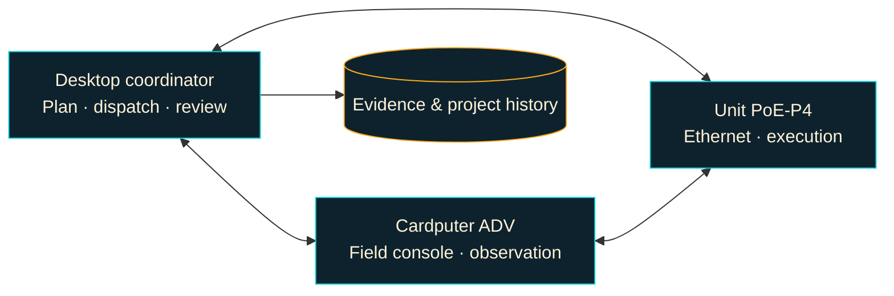

<div align="center">


# Reconclave

**A desktop hub. A handheld console. A cooperating fleet.**

Coordinate authorised security assessments, observe signals and keep evidence together.

[](https://github.com/Zetascrub/Reconclave/actions/workflows/ci.yml)
[](LICENSE)
[](#project-status)

[Get started](#get-started) · [Explore the fleet](#explore-the-fleet) · [Features](#what-you-can-do) · [Documentation](#documentation) · [Contribute](CONTRIBUTING.md)

</div>

---

Reconclave brings a desktop coordinator and purpose-built ESP32 devices into one
assessment workflow. Plan and review work on the desktop, use the Cardputer ADV
in the field, and delegate supported tasks to connected nodes. Each device
advertises its capabilities so the coordinator can work with the fleet that is
actually available.

The successor to Ghostwire, Reconclave is designed around cooperating nodes.
The desktop is the permanent hub; additional devices extend what the fleet can do.

> [!NOTE]
> **Development preview.** Features and hardware validation are still evolving.
> Start with the [project status](#project-status) and each device's guide before deploying.
>
> Use Reconclave only on systems and networks you own or are explicitly authorised to assess.

## Explore the fleet

| | Role | Explore |
| :-- | :-- | :-- |
| **Desktop coordinator** | Web interface, projects, workflows, fleet management and evidence custody. | [Desktop guide](tools/desktop-node/README.md) |
| **Cardputer ADV** | Portable console with network discovery, Wi-Fi/BLE observation, NFC and sub-GHz tools. | [Cardputer guide](devices/cardputer-adv/README.md) · [Hardware details & purchase](https://thepihut.com/products/m5stack-cardputer-adv) |
| **Unit PoE-P4** | Ethernet-attached execution node for network discovery, connectivity checks and automation. | [PoE-P4 guide](devices/poe-p4/README.md) · [Hardware details & purchase](https://thepihut.com/products/unit-poe-with-esp32-p4) |
| **K230 · planned** | Future vision and edge-AI node; not required for the current fleet. | [K230 notes](devices/k230/README.md) |



Nodes announce themselves over mDNS and expose supported capabilities through the
Reconclave protocol. Protected requests use provisioned per-peer HMAC keys and
boot-session binding. Discovery, authentication and transport encryption have
different boundaries—see the [trust architecture](docs/trust-architecture.md).

## What you can do

### Plan, coordinate and review

| Area | Capabilities |
| :-- | :-- |
| **Scoped assessment** | Operator-authorised, expiring engagement scopes for coordinator assessment workflows. |
| **Workflows** | Durable, retryable task graphs, with a visual workflow builder and JSON configuration. |
| **Distributed execution** | Scheduling by capability, load and topology, with failover and multiple observation points. |
| **Fleet operations** | Health and inventory, configuration drift, staged OTA rollout and rollback orchestration. |
| **Evidence** | Project-linked observations, content-addressed storage, custody records and at-rest encryption on supported paths. |
| **Analysis** | Offline vulnerability normalisation, correlation and confidence scoring, including Nessus/NASL import. |
| **Team controls** | Local operator accounts, roles, approvals and a searchable operations timeline. |
| **Extensibility** | Packaged tool runners with manifests, schemas and risk classes; availability follows installed capabilities. |

### Take the Cardputer into the field

- **Observe nearby networks:** Wi-Fi discovery, channel analysis and BLE discovery.
- **Inspect NFC tags:** discover NFC-A/B/F/V identifiers and view supported Type 2 text/URI content.
- **Write and emulate NDEF:** write text/URLs to supported formatted tags, or present virtual NFC-A/F tags. Reuse messages from microSD presets.
- **Watch sub-GHz activity:** receive-only signal history, adjustable thresholds, activity percentages and CSV exports with the CC1101 cap.
- **Keep controls close:** offline field mode, evidence exports, selectable themes and the mascot-inspired **Zeta Mascot** palette.

The [Cardputer guide](devices/cardputer-adv/README.md) covers accessory requirements,
key controls and exact tag compatibility. The RF display measures activity at a
selected frequency; it is not a swept spectrum analyser or packet decoder.

## Get started

### 1. Prepare your environment

| Component | Requirements |
| :-- | :-- |
| Desktop coordinator | Python **3.11+**, Node.js **22**, npm and Python virtualenv support |
| Cardputer firmware | PlatformIO; versions are specified in [platformio.ini](devices/cardputer-adv/platformio.ini) |
| PoE-P4 firmware | ESP-IDF **5.4.2**; follow the [device setup](devices/poe-p4/README.md) |
| Shared native tests | CMake and a C++17 toolchain |

### 2. Start the desktop

From the repository root, on a host with Bash:

```sh
./start-desktop.sh
```

Open **[127.0.0.1:8767](http://127.0.0.1:8767)** in your browser.

The launcher creates the Python environment and installs web dependencies on
first run, builds the interface when needed, then starts the coordinator in
`both` mode. Additional arguments are passed through to the desktop application.
See the [desktop guide](tools/desktop-node/README.md) for credentials, optional
assessment adapters and network-scan configuration.

### 3. Provision before building devices

Generate private trust headers **before** compiling or flashing. Replace these
synthetic examples with your actual fleet identities:

```sh
python3 tools/provision_fleet.py \
  --desktop-id rc-desktop-example \
  --p4-id rc-p4-example \
  --cardputer-id rc-adv-example
```

Follow the [trust guide](docs/trust-architecture.md) to obtain matching identities,
then build and flash using the [Cardputer](devices/cardputer-adv/README.md) or
[PoE-P4](devices/poe-p4/README.md) instructions. Re-running provisioning with the
same IDs preserves keys; rotation is an intentional fleet-wide operation.

> [!IMPORTANT]
> Generated trust headers and the fleet store are private deployment material.
> Firmware compiled with them contains deployment keys and must not be shared
> as a public download. See [release signing and packaging](docs/releasing.md).

## Project status

**A development preview, with automated checks and ongoing hardware validation.**

| Validation | Coverage |
| :-- | :-- |
| **GitHub CI** | Native tests, desktop Python tests, release/provisioning tests, frontend build, Cardputer compilation and secret scanning. |
| **Hardware** | Feature-specific checks and limitations are recorded in the device guides and [Cardputer review](docs/cardputer-firmware-review.md). Compilation does not establish interoperability. |
| **Release signing** | Detached Ed25519 signatures verify artifact bytes and metadata through the release CLI. Devices do not enforce these publisher manifests. |
| **Still ahead** | K230 integration, production encrypted transport, hardware-enforced boot trust and broader hardware coverage. |

Secure Boot is **not enabled** by the release tools. Existing fleet authentication
and OTA checks are separate from publisher signatures. Scope enforcement and
other security properties require validation across execution paths; the test
suite is not a complete security audit.

[Delivery roadmap →](docs/platform-roadmap.md) · [Security policy →](SECURITY.md) · [Release guide →](docs/releasing.md)

## Documentation

| I want to… | Read |
| :-- | :-- |
| Understand the system | [Architecture](docs/architecture.md) |
| Run the desktop coordinator | [Desktop guide](tools/desktop-node/README.md) |
| Build or use a device | [Cardputer ADV](devices/cardputer-adv/README.md) · [PoE-P4](devices/poe-p4/README.md) |
| Understand requests and capabilities | [Wire protocol](docs/protocol.md) · [Capability reference](docs/capabilities.md) |
| Manage identities and keys | [Fleet trust](docs/trust-architecture.md) |
| Prepare and verify a release | [Release signing](docs/releasing.md) |
| Work on the interface | [UI design](docs/ui-design.md) |
| Find planned work | [Platform roadmap](docs/platform-roadmap.md) |
| Report a vulnerability privately | [Security policy](SECURITY.md) |

<details>
<summary><strong>Run the shared native tests</strong></summary>

```sh
cmake -S . -B build
cmake --build build --parallel
ctest --test-dir build --output-on-failure
```

The [contribution guide](CONTRIBUTING.md) lists the desktop, web and release-tool
checks, together with expectations for documenting hardware validation.

</details>

## Contributing

Bug reports, documentation improvements and focused contributions are welcome.
Include the affected commit, your device/toolchain and reproducible steps.
For larger changes, discuss the scope first.

**Keep keys, private assessment data and provisioned firmware out of issues and
pull requests.** Suspected vulnerabilities should follow [SECURITY.md](SECURITY.md).

[Read the contribution guide →](CONTRIBUTING.md)

## Licence & artwork

**Code and documentation:** [MIT](LICENSE), except third-party material under its
own terms. See the [dependency notices](THIRD_PARTY_NOTICES.md).

**Zeta mascot, branding and generated image data:** rights reserved under
[ARTWORK_LICENSE.md](ARTWORK_LICENSE.md). They are **not covered by the MIT
licence**. Redistributing those assets requires separate permission or
replacement artwork.

---

<div align="center">

<strong>Reconclave</strong><br>
Plan on the desktop. Observe in the field. Keep the evidence together.

</div>
